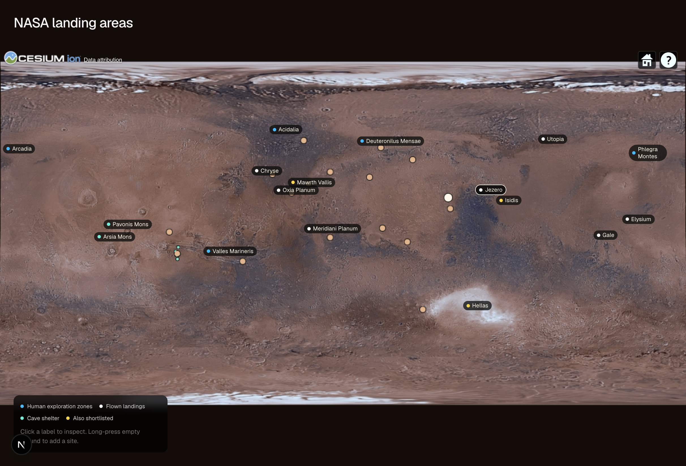
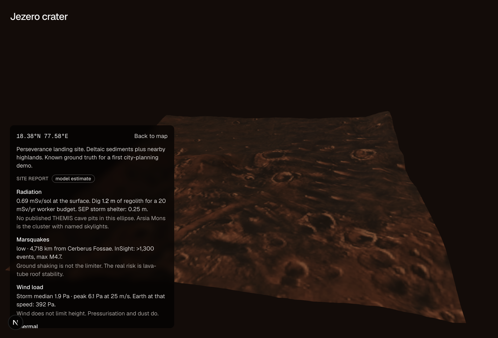

# Bury or build

GirlsWhoML × PhysicsX, 15 Sept 2026. **Track A, Architecture.**

Repo: [ghcpuman902/mars-hackathon-2026](https://github.com/ghcpuman902/mars-hackathon-2026)

A first city of 100 people has 730 sols before resupply, and a dust storm from sol 180 to 260. The question we actually answer is small. How much dirt goes over your head, and where?

## What we built

Pick a NASA landing area on a globe, or long-press empty ground for your own pin. Inspect opens a 3D patch of MOLA terrain and a site report.

The report says how deep to bury for a 20 mSv/year worker budget, how close you are to Cerberus Fossae quakes, what peak wind pressure the Track A Jezero storm would put on a wall, and how many metres of dirt you need before the annual temperature swing dies.

Tonight that is physics rules, not a trained model. Elevation, ice consistency, and published cave pits go in. Dig depth, quake tier, wind in pascals, and skin depth come out. A crew uses those numbers to decide bury versus build above ground.

We started from a Next.js starter on this laptop. The product itself was built during the event.

## How the decision works

`lib/site-physics.ts` is the whole "model."

Radiation starts from the MSL RAD surface dose at Gale, 0.64 mSv/sol, then thins or thickens with elevation using an atmospheric scale height. The dig depth is the dry-regolith cover that brings the annual dose down to 20 mSv. Solar-particle events only need about 25 cm.

Quake tier is distance to Cerberus Fossae. InSight's catalogue is the check, not a site seismometer. Ground shaking is rarely the limiter. A lava-tube roof is.

Wind uses three numbers we measured from the Track A hourly Jezero series. Peak 25.3 m/s, storm-median 14.2 m/s, clear-median 6.6 m/s. Dynamic pressure is ½ρv² with ρ from elevation. Even the peak is tens of pascals. Earth air at the same speed is hundreds. Wind does not limit height. Pressurisation and dust do.

Thermal skin depth uses a published regolith diffusivity. One Mars year damps out around 2.4 m. Mean temperature in the pack is −56 °C. Five metres of geothermal gain is 0.05 K. You bury for stability, then heat the volume with 100-person waste heat.

If a THEMIS skylight sits in the ellipse, the report compares the published roof thickness to the radiation cover. Arsia Mons is the only cluster with named pits tonight. We did not invent lava tubes in the mesh.

## Data we used

Weather and the four depths are honest about what they are. Radiation, seismic, wind-load, and thermal numbers are physics rules with cited constants, not site measurements. Wind and mean temperature come from the Track A simulated Jezero series, not a raw EMARS NetCDF.

| Used | Dataset | Path | Real or simulated | What we took |
| --- | --- | --- | --- | --- |
| Yes | Track A EMARS weather | `data/raw/official-packs/extracted/track-a-architecture-emars/` | Simulated, EMARS-informed | Wind max / storm-median / clear-median and mean temperature from the Jezero hourly series |
| Yes | MOLA 4 / 16 ppd | `data/raw/mola/` | Real raster | Elevation and local slope. 4 ppd heightmap for the inspect mesh and custom-pin sample |
| Yes | SWIM ice | `data/raw/swim/` | Real raster | Ice consistency at 0–1 m, 1–5 m, and >5 m |
| Yes | Curated sites | `data/raw/sites/candidate-sites.csv` | Curated pins | NASA landing areas on the globe |
| Yes | THEMIS cave pits | `lib/mars-caves.ts` | Published catalogue | Arsia Mons skylights, Cushing et al. 2007 |

We did not use Track B images, the trip timetable, the B2 mobility grid, or the Track C ECLSS log.

## How to run the demo

```bash
pnpm install
pnpm dev
```

Open [http://localhost:3000](http://localhost:3000). Jezero's report lives at [/site/jezero](http://localhost:3000/site/jezero).

1. Click a NASA label on the globe. Jezero is the flown-landing default.
2. Read the report. Radiation cover, quake tier, wind load, thermal depth.
3. Back to map, then try Arsia Mons if you want a cave comparison, or Gale if you want the RAD calibration site.

No `.env` secrets. `.env.example` is empty of keys. Do not commit `.env.local`.

To rebuild the scored site table after changing rasters:

```bash
source .venv/bin/activate
.venv/bin/python ml/prepare_demo_layers.py
```

## Demo screenshots

If the network dies, these are the two beats.





## Three minutes on stage

Minute 0–1. 100 people, 730 sols, storm 180–260. The first habitat has to decide bury versus build before anyone argues about a hotel.

Minute 1–2. Globe, pick Jezero, inspect. The report is the stable thing on screen. No live training.

Minute 2–3. The four numbers, and why a first city would care. High ground costs more cover. A cave roof can already be enough. Wind is a rounding error next to keeping 101 kPa inside.

Q&A. Weather is a hack-ready simulation. The depths are rules. Another day would train a site ranker on the same features, or pull real EMARS at more than one pin.

## Citations

- EMARS framing: Greybush et al., 2019, *Geoscience Data Journal*, [doi:10.1002/gdj3.77](https://doi.org/10.1002/gdj3.77). Pack credit: [docs/hackathon/official-source/CREDITS.txt](docs/hackathon/official-source/CREDITS.txt)
- MSL RAD surface dose: Hassler et al., 2014
- Cruise GCR dose: Zeitlin et al., 2013
- Regolith attenuation, order of magnitude: Röstel et al., 2020
- THEMIS pits: Cushing, Titus, Wynne, Christensen, 2007
- MOLA: NASA / GSFC / MOLA Science Team
- SWIM ice consistency: Putzig, Morgan, et al., Planetary Science Institute
- InSight event counts as cited on the report

## Stack

Next.js 16, React 19, TypeScript, Tailwind 4, Cesium for the globe, Three.js for the inspect mesh. `pnpm` for JS. Python 3.12 in `.venv` only if you regenerate rasters.

## Also in this repo

Sol Zero Console is a ten-card walkthrough of pack numbers, with a LightGBM terrain-cost surface and a storm detector. It is not the thing on screen at minute two. After `pnpm dev`, open [/sol-zero-console/](http://localhost:3000/sol-zero-console/). Models live in `ml/settlement/`. Packs A, B2, and C used there are simulated.

## Licence

Event build for GirlsWhoML × PhysicsX. Cite the upstream datasets before you reuse them.
